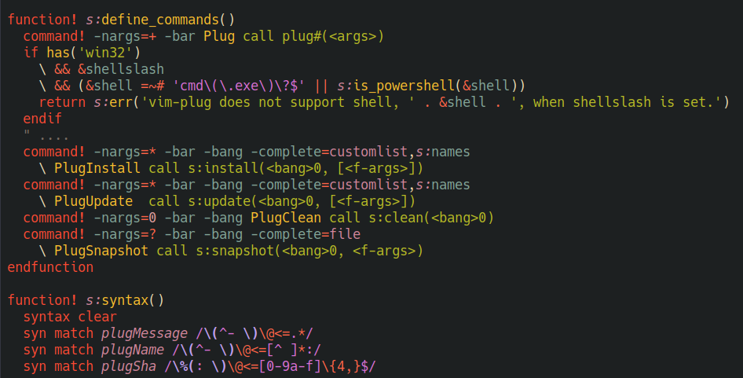

# Vim script major mode using tree-sitter

[](https://www.gnu.org/licenses/gpl-3.0)

This package provides a major-mode for vimscript using the tree-sitter 
grammar from https://github.com/neovim/tree-sitter-vim.

Features:
- indentation
- font-locking
- imenu
- structural navigation with treesitter objects

When parsers are available for lua or  ruby, they will be used to parse embedded
code blocks.  See `lua-ts-mode`  and `ruby-ts-mode`  for more  information about
those parsers.



## Installing

Emacs 29.1 or above with tree-sitter support is required. 

Tree-sitter starter guide: https://git.savannah.gnu.org/cgit/emacs.git/tree/admin/notes/tree-sitter/starter-guide?h=emacs-29

### Install tree-sitter parser for vim

Add the source to `treesit-language-source-alist`. 

```elisp
(add-to-list
 'treesit-language-source-alist
 '(vim "https://github.com/neovim/tree-sitter-vim"))
```

Optionally, install grammars for `lua` and `ruby` to enable
font-locking/indentation for embedded lua / ruby code.

Then run `M-x treesit-install-language-grammar` and select `vim` to install.

### Install vimscript-ts-mode from melpa

`M-x package-install vimscript-ts-mode`

### Install vimscript-ts-mode.el from source

- Clone this repository
- Add the following to your emacs config

```elisp
(require "[cloned nverno/vimscript-ts-mode]/vimscript-ts-mode.el")
```

### Troubleshooting

If you get the following warning:

```
⛔ Warning (treesit): Cannot activate tree-sitter, because tree-sitter
library is not compiled with Emacs [2 times]
```

Then you do not have tree-sitter support for your emacs installation.

If you get the following warnings:
```
⛔ Warning (treesit): Cannot activate tree-sitter, because language grammar for vim is unavailable (not-found): (libtree-sitter-vim libtree-sitter-vim.so) No such file or directory
```

then the vim grammar files are not properly installed on your system.
